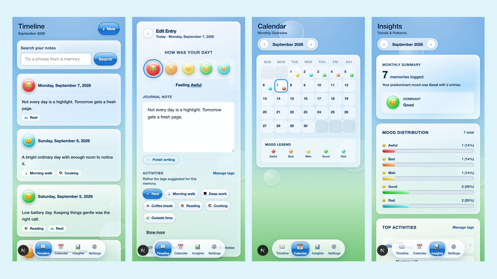

# Aero Diary

Aero Diary is a private mood journal with a bright **Frutiger Aero** visual style.

Write about your day naturally, and Aero Diary can use an LLM to automatically infer and attach relevant activities from your journal entry.



## Highlights

- ✨ **Automatic activity inference** — an LLM analyzes journal entries and attaches matching activities automatically.
- 📝 **Mood journaling** — record notes, moods, activities, favorites, and photos.
- 📅 **Timeline & calendar** — browse memories chronologically or by date.
- 📊 **Insights** — explore patterns across moods and activities.
- 🪄 **AI-assisted polishing** — optionally improve journal entries through an OpenAI-compatible LLM.
- 📷 **Photo support** — attach photos to journal entries.
- 🔐 **Private by design** — journal data is protected behind authentication.
- 🌤️ **Frutiger Aero UI** — glass panels, gradients, glossy controls, bubbles, and mood-driven visuals.

## Tech Stack

**Next.js 16 · React 19 · TypeScript · Prisma · SQLite · Tailwind CSS · Vitest · Playwright**

LLM features support OpenAI-compatible APIs.

## Local Development

Requires Node.js 22+ and pnpm.
```bash
pnpm install
cp .env.example .env.local
pnpm db:migrate
pnpm create-user you@example.com your-password
pnpm dev
```

Then open `http://localhost:3000`.

See `.env.example` for optional LLM and Google Drive configuration.
